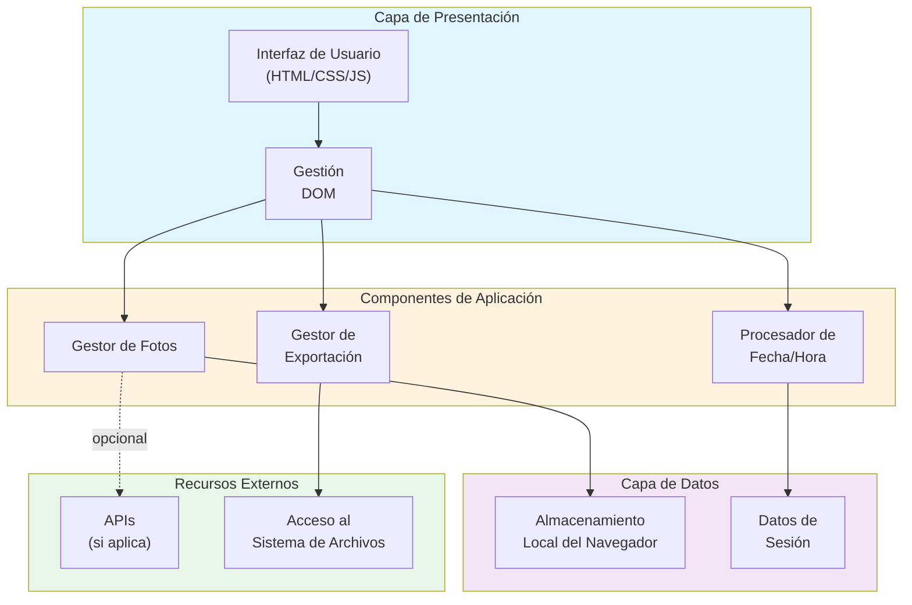

# Descripción General de la Arquitectura

Este documento proporciona una descripción general de la arquitectura del proyecto Fotofecha.

## Arquitectura del Sistema

## Descripción de Componentes

### Capa de Presentación
- **Interfaz de Usuario**: Marcado HTML, estilos CSS e interactividad JavaScript
- **Gestión DOM**: Maneja actualizaciones dinámicas e interacciones del usuario

### Componentes de Aplicación
- **Gestor de Fotos**: Administra carga, visualización y procesamiento de fotos
- **Procesador de Fecha/Hora**: Maneja extracción y formato de información de fecha/hora
- **Gestor de Exportación**: Gestiona la funcionalidad de exportación a archivos (PDF, imagen, etc.)

### Capa de Datos
- **Almacenamiento Local**: Almacenamiento persistente del navegador para preferencias y datos del usuario
- **Datos de Sesión**: Información basada en sesión temporal

### Recursos Externos
- **APIs**: Integraciones opcionales con servicios externos
- **Sistema de Archivos**: API de navegador para descargas y cargas

## Flujo de Datos

1. El usuario carga o selecciona una foto a través de la interfaz
2. El Gestor de Fotos procesa la imagen
3. El Procesador de Fecha/Hora extrae o asocia información de fecha
4. Los datos se almacenan en Almacenamiento Local y/o de Sesión
5. El usuario puede exportar los datos procesados a archivos

## Tecnologías Utilizadas

- **HTML5**: Estructura y marcado
- **CSS3**: Estilos y diseño responsivo
- **JavaScript**: Lógica de aplicación e interactividad
- **APIs del Navegador**: File API, LocalStorage API, Canvas API (si hay procesamiento de imágenes)

---

*Última actualización: 2026-08-11*
